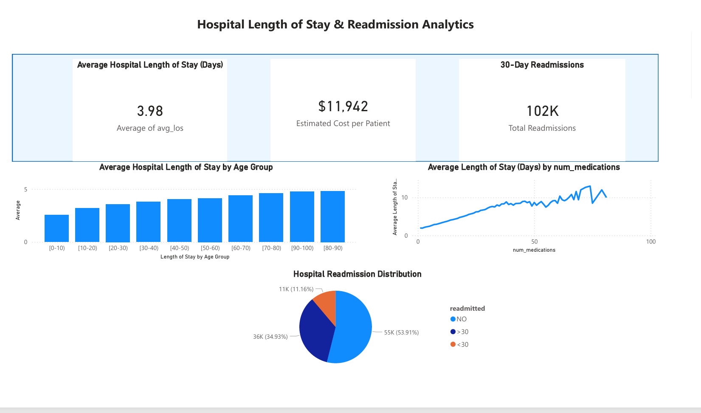
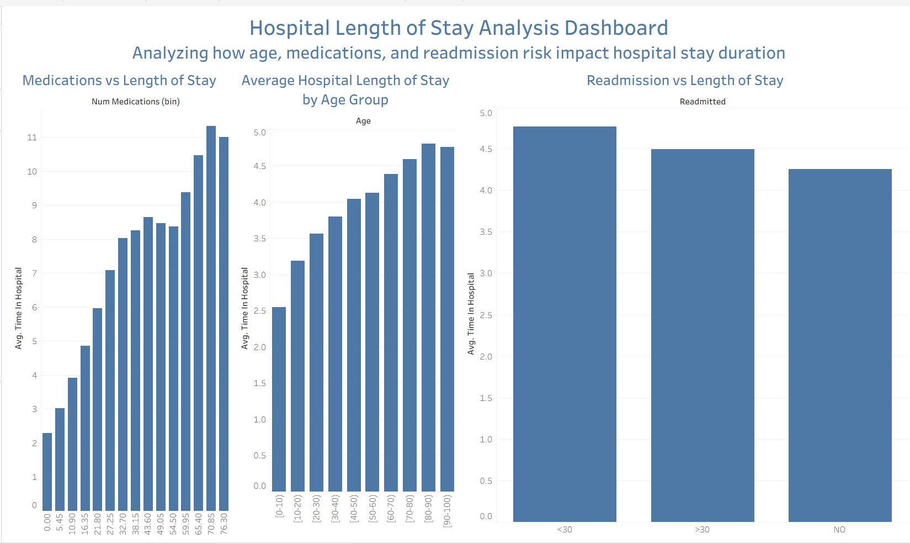

# Healthcare Analytics: Hospital Readmission & Length-of-Stay Analysis

### Healthcare Data Science & Analytics Project

This project analyzes hospital **length-of-stay (LOS) trends and 30-day readmission patterns** using a U.S. clinical dataset containing **100,000+ patient encounters across 130 hospitals**.

The analysis combines **SQL data querying**, **Python-based predictive modeling**, **R data processing**, and **interactive dashboards in Power BI and Tableau** to identify high-risk patient populations and operational drivers of hospital utilization.

- **SQL** was used for data extraction, querying, and aggregation of healthcare datasets  
- **Python** was used for data cleaning, exploratory analysis, and building a **logistic regression model** to predict readmission risk  
- **R** was used for additional data transformation and statistical analysis of length-of-stay trends  
- **Power BI and Tableau** were used to create interactive dashboards analyzing LOS, readmissions, and patient complexity  

This project demonstrates an **end-to-end healthcare analytics workflow**, from raw data querying to predictive modeling and business intelligence dashboards.

---

# Power BI Dashboard – Length of Stay Analysis

This dashboard focuses on **hospital operational analytics**, analyzing the key drivers of patient length of stay and associated cost impact.

Key insights include:

- Average LOS by age group  
- Relationship between medication count and hospitalization duration  
- Readmission distribution across patient populations  
- Estimated cost per patient based on LOS  

The dashboard highlights how healthcare organizations can use analytics to improve **efficiency, reduce unnecessary hospital days, and manage costs**.

---

# Tableau Dashboard – Hospital Utilization Trends

An interactive **Tableau dashboard** was created to further explore hospital utilization patterns and operational insights.

Key factors analyzed:

- Patient age vs length of stay  
- Readmission status vs hospitalization duration  
- Medication complexity vs hospital stay length  

This dashboard highlights how analytics tools like Tableau can support **healthcare operational decision-making and resource planning**.

---

# Predictive Modeling – Hospital Readmission Risk

Hospital readmissions are a major cost driver in healthcare. This project uses **Python** to build a predictive model that identifies patients at higher risk of 30-day readmission.

Key steps:

- Data cleaning and preprocessing using Python  
- Exploratory data analysis (EDA)  
- Feature selection and preparation  
- Logistic regression modeling  
- Visualization of high-risk patient groups  

The model helps demonstrate how healthcare systems can proactively identify patients who may require additional care planning before discharge.
---

# Tools & Technologies

- **Python** (Pandas, NumPy, Scikit-learn)
- **SQL** (querying, aggregation, and healthcare data analysis)
- **R** (data preparation and statistical analysis)
- **Power BI** (interactive dashboard development)
- **Tableau** (data visualization and operational dashboards)
- **Matplotlib** (Data Visualization)

---

# Key Insights

Analysis of **100,000+ hospital encounters** revealed several patterns in patient outcomes:

- Length of stay increases steadily with older age groups
- Higher medication counts correlate with longer hospital stays
- Readmission risk increases significantly for patients over age 70
- Certain diagnosis groups show higher readmission probability

These findings demonstrate how healthcare analytics can help hospitals **identify high-risk populations and reduce avoidable readmissions**.

---

# Data Visualizations

### Readmission Rate by Age

### Readmission Rate by Race

### Diagnoses with Highest Readmission Rates

---

# Project Files

- `healthcare_length_of_stay_dashboard.pbix` – Power BI dashboard
- `hospital_analysis.R` – R analysis for LOS metrics
- `premier_readmission_project_starter.py` – Python readmission modeling
- `diabetic_data.csv` – healthcare dataset

